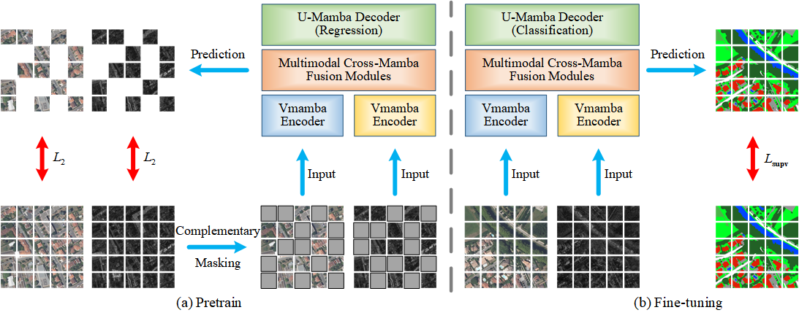
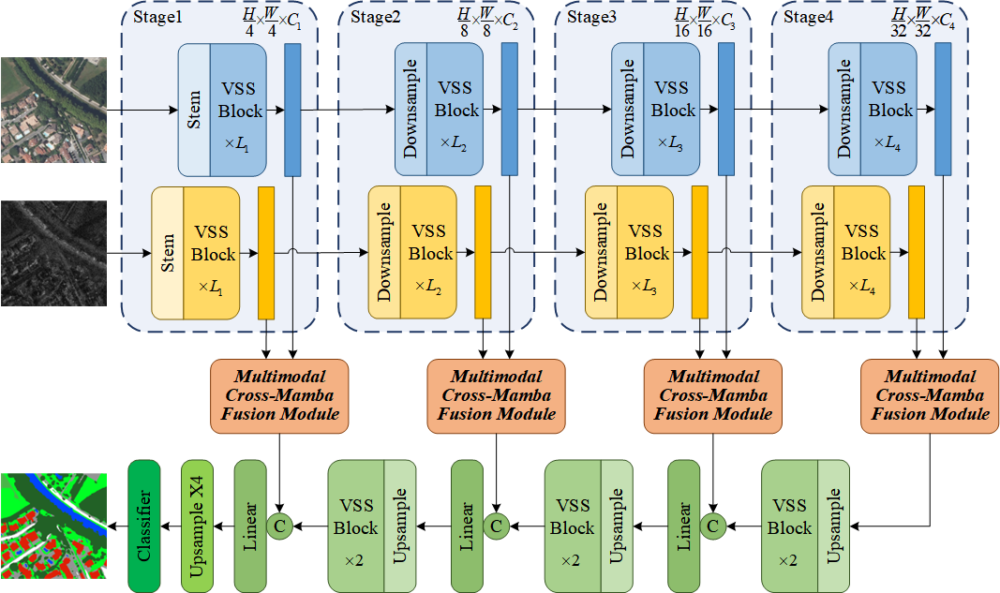
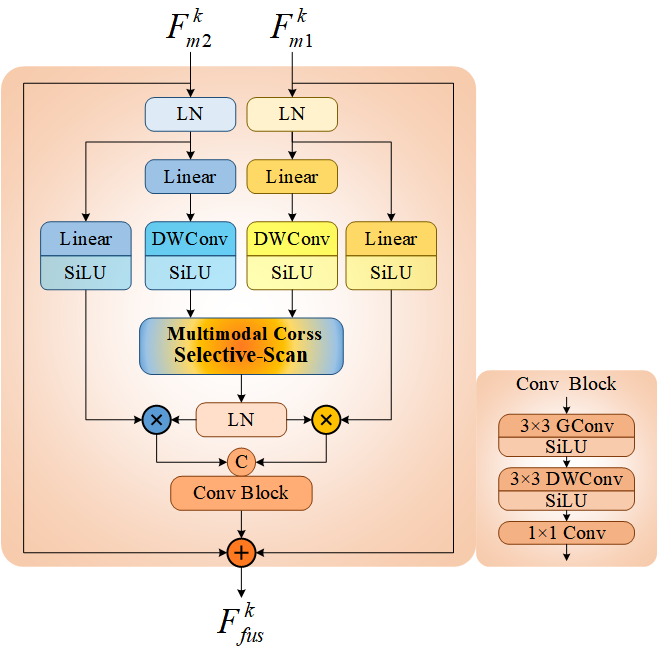

# Multimodal Cross Fusion Mamba Network for Remote Sensing Image Semantic Segmentation with Complementary Masked Self-supervision

## Abstract
Deep learning-based multimodal remote sensing image (RSI) semantic segmentation models have garnered significant attention owing to their ability to leverage complementary information across modalities, resulting in more robust and accurate Earth observation. 
However, most existing approaches rely predominantly on convolutional neural networks with limited receptive fields or transformer-based architectures that are computationally intensive. 
In this study, we proposed a multimodal cross fusion Mamba (MCF-Mamba) network for multimodal RSI semantic segmentation, aiming to collaboratively enhance accuracy and efficiency. 
The proposed network features three core components: a dual-branch VMamba encoder, a multimodal cross-Mamba fusion module, and a U-shaped Mamba decoder. The architecture with a unified structure centered on the selective state space model ensures that it achieves global perception with linear complexity. 
Furthermore, for addressing the constraint of limited labeled samples in practical applications, we developed a generative multimodal complementary masked self-supervised (CMSS) strategy. It leverages abundant unlabeled RSIs to learn generalized multimodal representations by modeling intermodal complementary consistency. 
Extensive experiments on three public datasets involving optical-SAR and optical-DEM modalities demonstrated that the proposed network and strategy are superior to other advanced segmentation models and self-supervised methods in land cover mapping and building extraction tasks. The MCF-Mamba network achieves the highest accuracy while significantly reducing both model size and computational cost, and further improves the accuracy and generalization through the CMSS strategy.

## Overview

### Multimodal Complementary Masked Self-supervised (CMSS)

<p align="center">
  
</p>

### Multimodal Cross Fusion Mamba (MCF-Mamba) Network

<p align="center">
  
  
</p>

## Getting Started

### Requirements

- The network is based on VMamba_Tiny. Please refer to [VMamba repository](https://github.com/MzeroMiko/VMamba) for configuration.

### Datasets

We use three datasets:
- [DFC2020](https://ieee-dataport.org/competitions/2020-ieee-grss-data-fusion-contest) (optical-SAR, multiclass land cover classification)
- [MSAW](https://spacenet.ai/sn6-challenge) (optical-SAR, single-class building extraction)
- [Hunan](https://github.com/LauraChow/HunanMultimodalDataset) (optical-DEM, multiclass land cover classification)

### Model Training and Inference
- To train MCF-Mamba models on DFC2020, use the `tool\main-MCFMamba.py`.
- To pre-train the model using the CMSS strategy and then fine-tune it, please use `tool\main-MCFMamba_CMSS.py`.

## Citation

If this work is helpful to your research, please cite it as follows:
```
@article{liu2025multimodal,
  title={Multimodal cross fusion Mamba network for remote sensing image semantic segmentation with complementary masked self-supervision},
  author={Liu, Xiao and Wang, Tao and Jin, Fei and Rui, Jie and Wang, Shuxiang and Huang, Ziheng and Zou, Yujie and Yu, Xiaowei},
  journal={International Journal of Applied Earth Observation and Geoinformation},
  volume={145},
  pages={104960},
  year={2025},
  publisher={Elsevier}
}
```